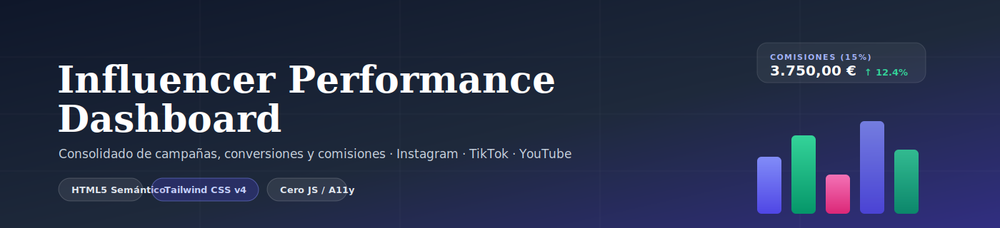

<p align="center">
  
</p>

<p align="center">
  
  
  
  
  
</p>

# 📊 Influencer Performance Dashboard

Dashboard estático de analítica de campañas para creadoras/influencers, construido **100% con HTML5 semántico y Tailwind CSS v4 nativo** — sin frameworks JavaScript, sin CDN, sin dependencias de runtime.

---

## 🚀 Introducción y Propósito del Proyecto

Una influencer que promociona productos en **Instagram, TikTok y YouTube** genera datos de rendimiento dispersos: métricas de alcance en cada red social, reportes de ventas del anunciante, y sus propias notas de comisión. Sin un punto único de consulta, resulta difícil responder con rapidez preguntas básicas del negocio: *¿cuánto he ganado este mes?*, *¿qué producto merece más esfuerzo de promoción?*, *¿en qué red social debería invertir más contenido?*

Este dashboard **consolida esos datos en una sola vista** — KPIs, drivers de rendimiento y detalle operacional — para que la influencer pueda tomar decisiones informadas sobre en qué plataforma y qué producto enfocar su próxima campaña, sin depender de hojas de cálculo dispersas ni herramientas externas.

## 🎯 Respuestas a las Preguntas de Negocio

El dashboard está diseñado para que cada bloque responda directamente a una pregunta de negocio concreta:

| Pregunta de negocio | Dónde se responde | Cómo |
|---|---|---|
| 💶 **¿Cuánto dinero estoy generando en comisiones?** | KPI *"Total Comisiones (15%)"* | Comisión total calculada sobre las ventas cerradas de los 3 productos, con variación vs. el mes anterior |
| 🏆 **¿Qué productos están generando más ingresos?** | Driver *"Rendimiento por Producto"* + Tabla *"Análisis Detallado por Producto"* | Barras comparativas de comisión por producto y tabla con precio unitario, unidades vendidas, comisión recibida y ROI cualitativo |
| 🔻 **¿Qué tan bien convierten mis anuncios?** | Driver *"Embudo de Conversión"* | Visualiza la caída progresiva Alcance → Clics → Ventas, junto con el CTR de cada etapa |
| 📱 **¿Qué plataformas rinden mejor?** | Driver *"Retorno por Plataforma"* | Compara ingresos y tasa de conversión de Instagram, TikTok y YouTube en barras independientes |

Adicionalmente, el bloque de **Alertas** (`role="status"`) señala automáticamente anomalías relevantes, como una caída de CTR en una campaña específica, sin que la influencer tenga que ir a buscarlas manualmente.

## 🛠️ Stack Tecnológico & Arquitectura

### CSS: Tailwind CSS v4 nativo (sin CDN)

El proyecto usa el **CLI oficial de Tailwind CSS v4** (`@tailwindcss/cli`) en lugar del antiguo `cdn.tailwindcss.com` o cualquier script de navegador. Esto significa:

- ✅ **CSS compilado y purgado**: solo se genera el CSS de las clases realmente usadas en `index.html` — sin overhead de un motor de utilidades cargado en el cliente.
- ✅ **Sin `tailwind.config.js`**: Tailwind v4 se configura de forma "CSS-first" mediante una única directiva `@import "tailwindcss";` en `src/input.css` — no quedan restos de configuración de v3.
- ✅ **Cero JavaScript de aplicación**: el proyecto no usa React, Vue, Svelte ni scripts propios. Toda la interactividad visual (hover de filas, badges, indicadores) se resuelve con utilidades y pseudo-clases de Tailwind.

### HTML5 Semántico y Accesibilidad (A11y)

En lugar de una sopa de `<div>`, cada bloque usa la etiqueta que mejor describe su función:

- **Landmarks de página**: `<header>`, `<main>`, `<footer>` — permiten a un lector de pantalla saltar entre regiones sin leer todo el documento.
- **`<section>` / `<article>`**: cada sección del dashboard (`KPIs`, `Drivers`, `Operacional`) es un `<section aria-labelledby="...">` con su propio título accesible; cada tarjeta de KPI es un `<article>` autocontenido.
- **`<dl>` / `<dt>` / `<dd>` para los KPIs**: un KPI es semánticamente un *par etiqueta-valor* (ej. "Total Comisiones" → "3.750,00 €"), no un título de sección. Por eso se usa una lista de definiciones en lugar de un `<h3>` con el número dentro — esto evita romper la jerarquía de encabezados que usan los usuarios de lector de pantalla para navegar la página.
- **Tabla de datos real**: `<thead>`/`<tbody>`/`<th scope="col">`/`<th scope="row">`/`<caption class="sr-only">` — cada celda se asocia correctamente con su fila y columna, y el contenedor con scroll horizontal es accesible por teclado (`tabindex="0"`, `role="region"`).
- **`<ul>`/`<li>` para el panel de Alertas**: las alertas son una lista de elementos del mismo tipo, no un bloque de texto suelto — usar una lista semántica permite que crezca a futuro sin cambiar la estructura, y que un lector de pantalla anuncie cuántos elementos contiene.
- **Contraste y estados dinámicos**: colores ajustados a AA (mínimo 4.5:1), badges de estado con `role="status"`, iconografía puramente decorativa (íconos de marca SVG inline, flechas de tendencia) marcada con `aria-hidden="true"`.

## 📦 Estructura del Proyecto

```text
Influencer-Analytics-Dashboard/
├── assets/
│   └── banner.svg          # Banner del README (SVG, sin dependencias externas)
├── dist/
│   └── output.css          # CSS compilado por Tailwind (generado, no editar a mano)
├── src/
│   └── input.css           # Punto de entrada de Tailwind v4 (@import "tailwindcss";)
├── index.html               # Dashboard completo: HTML semántico + clases Tailwind
├── package.json              # Dependencias de build (tailwindcss, @tailwindcss/cli)
├── server.py                  # Servidor local opcional (Flask) para previsualizar
└── README.md
```

## ⚙️ Instrucciones de Instalación y Desarrollo

### 1. Preparar el proyecto

```bash
git clone <url-del-repositorio>
cd Influencer-Analytics-Dashboard
npm install
```

### 2. Compilar Tailwind CSS v4

**Build único** (una sola compilación del CSS final):

```bash
npx @tailwindcss/cli -i ./src/input.css -o ./dist/output.css
```

**Modo watch** (recompila automáticamente mientras editas clases en `index.html`):

```bash
npx @tailwindcss/cli -i ./src/input.css -o ./dist/output.css --watch
```

> 💡 Ambos comandos están también disponibles como scripts de npm:
> ```bash
> npm run build:css   # build único
> npm run watch:css   # modo watch
> ```

### 3. Previsualizar el dashboard

Al no depender de ningún framework, basta con abrir `index.html` directamente en el navegador, o levantar el servidor local incluido:

```bash
pip3 install flask && python3 server.py
```

## 📈 Decisiones de Diseño y UX

### Mobile-First con 3 breakpoints

Todas las clases de layout parten de la versión **móvil sin prefijo** y se amplían progresivamente:

```html
<div class="grid grid-cols-1 md:grid-cols-2 lg:grid-cols-3 gap-6">
```

- 📱 **Móvil** (sin prefijo): 1 columna, contenido apilado verticalmente.
- 📟 **Tablet** (`md:`): 2 columnas.
- 🖥️ **Desktop** (`lg:`): 3 columnas.

La única zona con contenido potencialmente más ancho que la pantalla (la tabla de productos) queda encapsulada en un contenedor `overflow-x-auto` propio, evitando que ningún elemento provoque **scroll horizontal a nivel de página**.

### Gráficos "drivers" sin JavaScript ni librerías de charting

Los paneles *Retorno por Plataforma*, *Rendimiento por Producto* y *Embudo de Conversión* se construyen únicamente con utilidades de Tailwind, sin Canvas, SVG generado dinámicamente ni ninguna librería de charting:

- **Barras verticales**: un contenedor con altura fija (`h-40`) y `items-end` define la línea base común; cada barra es un `<div>` con `style="height: X%"` relativo a esa altura, coloreado según la categoría (plataforma o producto). El eje de categorías combina el nombre en texto real con un ícono de marca SVG inline decorativo (`aria-hidden`) del mismo color que su barra.
- **Embudo con trapecios reales**: cada etapa (*Alcance → Clics → Conversión*) es un `<div>` recortado con `style="clip-path: polygon(...)"` sobre un color de fondo de utilidad Tailwind — no son rectángulos con márgenes simulando un embudo, sino la forma geométrica real, con el estrechamiento progresivo comunicando la caída de volumen entre etapas.
- Todo grupo de barras o el embudo completo se envuelve en `role="img"` + `aria-label` consolidado: como el valor exacto ya está impreso en el gráfico, un lector de pantalla recibe una sola descripción completa (ej. *"Instagram 1.850€, TikTok 1.200€, YouTube 700€"*) en vez de recorrer divs vacíos uno por uno.

Este enfoque evita cargar Chart.js/D3 u otra librería externa: el "gráfico" es, en esencia, CSS puro (flexbox + `clip-path`) con datos ya conocidos en tiempo de diseño, ideal para un dashboard estático como este.

---

<p align="center">© 2026 Influencer Analytics Dashboard — Construido con HTML semántico y Tailwind CSS v4.</p>
